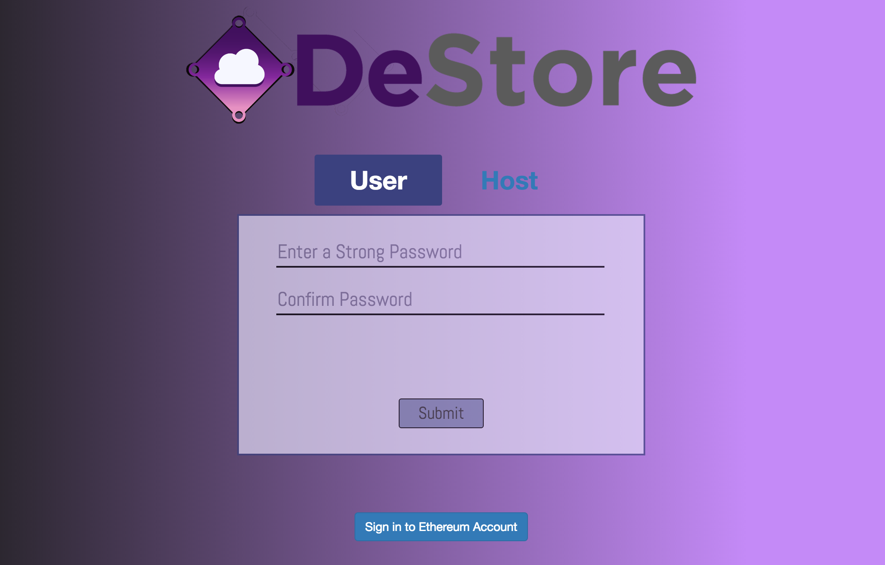
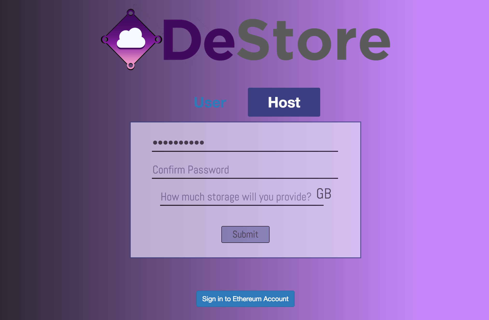
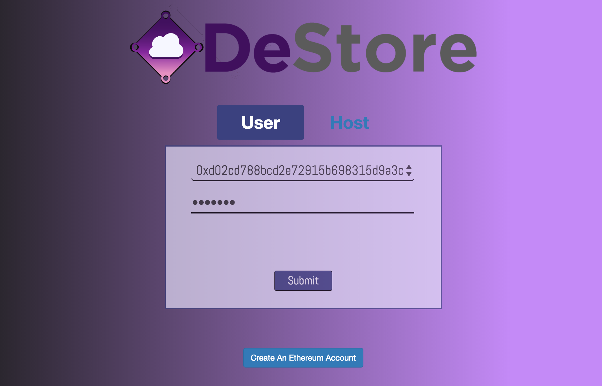
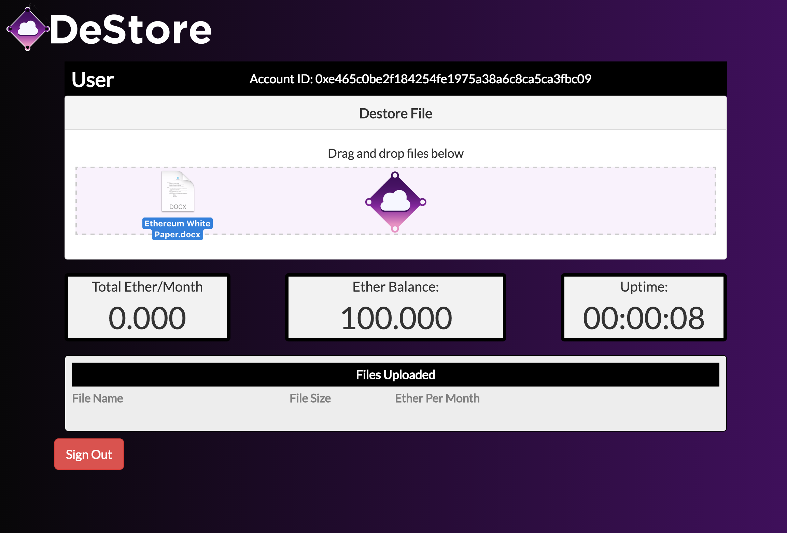
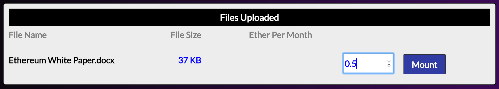
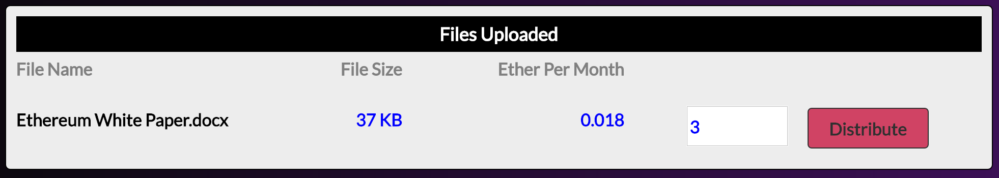
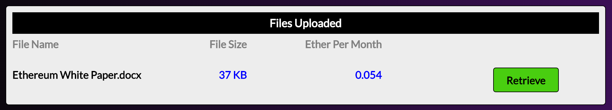
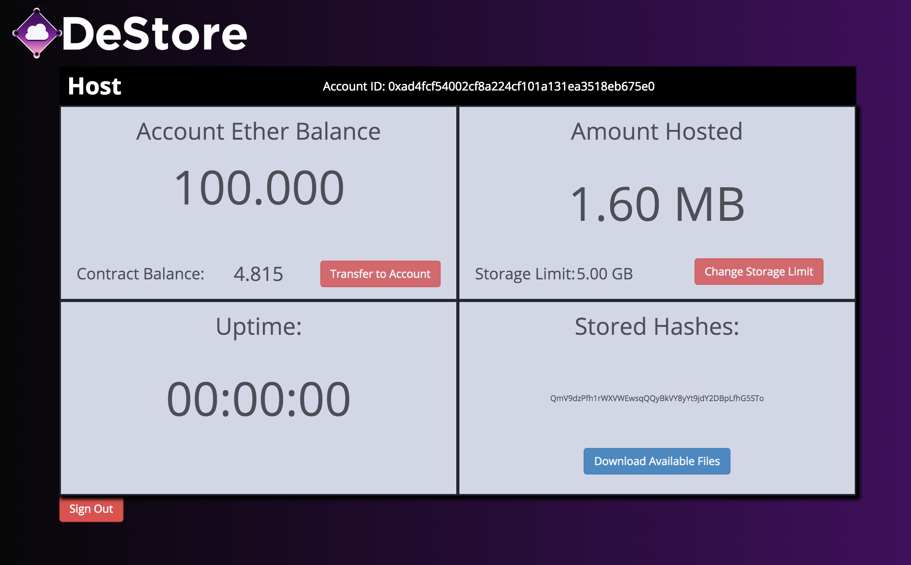

 

## Purpose
DeStore aims to create a decentralized peer-to-peer file storage platform with a trustless crytocurrency payment system. It is built on top of Ethereum to provide the platform with a decentralized logic base and dencentralized global state. It is also built on top of IPFS to provide the platform with content addressable peer-to-peer file distribution. 

## Setup

### Dependency Installation
In order to use the capabilities of DeStore, we must first install [IPFS](https://ipfs.io/docs/install) and [Ethereum](https://www.ethereum.org/cli#geth). Please follow the links to complete each respective download before trying to start the app

### Package Installation

`npm install`
`npm start`

## Application Overview

### Sign In & Sign Up

### User View

### Host View

