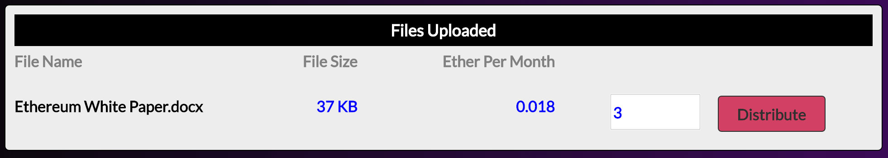

# DeStore
DeStore aims to create a decentralized peer-to-peer file storage platform with a trustless crytocurrency payment system. It is built on top of Ethereum to provide the platform with a decentralized logic base and dencentralized global state. It is also built on top of IPFS to provide the platform with content addressable peer-to-peer file distribution. 

